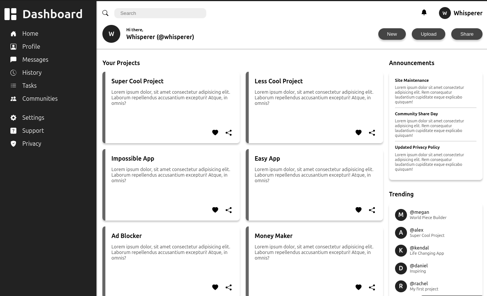

# Odin Dashboard

This project is part of _The Odin Project_ curriculum.  
Its purpose is to showcase my ability to build complex layouts and position elements effectively using **advanced CSS Grid techniques**.

## What This Project Demonstrates

- Structuring a responsive grid layout from scratch.
- Nesting grids to organize content within sections.
- Using `grid-template-areas` for intuitive layout design.
- Combining grid with flexbox for precise alignment and spacing.
- Building a modern dashboard UI using only HTML and CSS.

## Preview

## Features

- Fully responsive dashboard layout.
- Clear, scalable grid-based structure.
- Easy to extend with additional widgets/section
